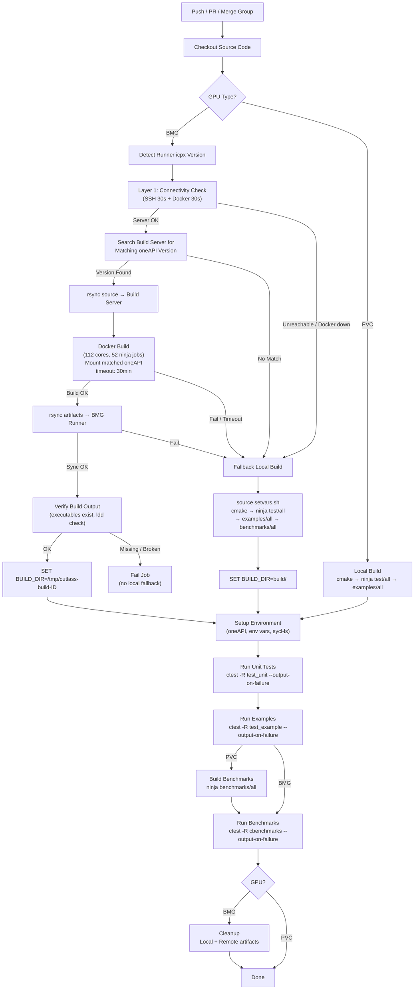

# CUTLASS SYCL CI Workflow — BMG Remote Build with Local Fallback

## Architecture Overview

```
                    ┌─────────────────────────────────────────────────┐
                    │           Build Server (shliclel4165)           │
                    │  112 cores │ Docker │ ocloc v26.x (mounted)     │
                    └────────────────────┬────────────────────────────┘
                                   SSH + rsync
                    ┌────────────────────┴────────────────────────────┐
              ┌─────┴─────┐     ┌─────┴─────┐     ┌─────┴─────┐
              │  DUT2010  │     │  DUT2027  │     │  DUT2039  │
              │  BMG GPU  │     │  BMG GPU  │     │  BMG GPU  │
              │ ocloc v26 │     │ ocloc v26 │     │ ocloc v26 │
              └───────────┘     └───────────┘     └───────────┘
                        BMG Runners (shanghai-bmg)
```

## Flow Diagram



## Three-Layer Protection

### Layer 0: Compiler Version Match

```bash
# Get runner's compiler version
RUNNER_ICPX_VER=$(icpx --version | head -1)

# Search build server for matching version
# 1. Try same path as runner
# 2. Scan /opt/intel/oneapi-pytorch/*/
MATCH=$(ssh BUILD_SERVER "find matching icpx version")
```

| Check              | Action if failed                    |
|--------------------|-------------------------------------|
| Version mismatch   | Warning + immediate local fallback  |

> Prevents wasting ~20 min compiling binaries that won't run on the runner.

### Layer 1: Quick Connectivity Check (~30s)

```bash
ssh -o ConnectTimeout=30 -o BatchMode=yes \
  BUILD_SERVER "timeout 30 docker info > /dev/null 2>&1"
```

| Check          | Timeout | Scenario                          |
|----------------|---------|-----------------------------------|
| SSH connection | 30s     | Server down / network unreachable |
| Docker daemon  | 30s     | Docker service hung / crashed     |

> Worst case: ~1 min to detect → immediately fallback

### Layer 2: Build Timeout (30 min)

```yaml
timeout-minutes: 30    # GitHub Actions step-level timeout
continue-on-error: true # Don't fail the whole job
```

| Scenario                      | Detection    |
|-------------------------------|-------------|
| Docker container OOM / hang   | ≤ 30 min    |
| SSH connection drops mid-build| ≤ 30 min    |
| Build server disk full        | ≤ 30 min    |

## Fallback Trigger

```yaml
- name: Fallback Local Build (BMG)
  if: steps.remote-build.outcome != 'success'
```

The fallback uses the **BMG runner's native environment**:
- `ocloc v26.03` — natively supports BMG (no workaround needed)
- `cmake`, `ninja`, `icpx` — all pre-installed
- Same CMake flags as remote build
- Disables `flash_attention` to avoid OOM

## Failure Scenarios

| Scenario                       | Layer | Response Time | Action               |
|--------------------------------|-------|--------------|------------------------|
| oneAPI version mismatch        | 0     | ~5s          | Fallback local build   |
| Build server unreachable       | 1     | ~30s         | Fallback local build   |
| Docker daemon unresponsive     | 1     | ~30s         | Fallback local build   |
| Docker container OOM / hang    | 2     | ≤30 min      | Fallback local build   |
| SSH drops during build         | 2     | ≤30 min      | Fallback local build   |
| Build output missing/broken    | V     | ~5s          | Fallback local build   |
| Code compilation error         | 2     | ~16 min      | Fallback → also fails  |
| Normal successful build        | —     | ~16 min      | Skip fallback          |

## Cleanup (always runs)

```bash
# Local: remove build artifacts
rm -rf /tmp/cutlass-build-${BUILD_ID}

# Remote: remove source + build outputs
ssh BUILD_SERVER "sudo -n rm -rf /home/gta/ci-builds/${BUILD_ID} /shared/builds/${BUILD_ID}"
```

- `if: always()` — runs regardless of success/failure
- `sudo -n` — non-interactive, won't hang waiting for password
- `|| true` — don't fail if server unreachable during cleanup
- **24h auto-cleanup**: stale artifacts cleaned on next successful run

## Key Components

| Component              | Location                                    | Purpose                        |
|------------------------|---------------------------------------------|--------------------------------|
| Build Server           | `shliclel4165.sh.intel.com` (112 cores)     | Fast SYCL compilation          |
| Docker Image           | `cutlass-builder:latest`                    | Reproducible build environment |
| Docker Proxy           | `~/.docker/config.json` on build server     | FetchContent (googletest)      |
| bmg-ocloc              | `/home/gta/tools/bmg-ocloc` on build server | ocloc v26.03 for Docker        |
| BMG Runners            | DUT2010 / DUT2027 / DUT2039                 | GPU test execution + fallback  |
