# CUTLASS SYCL CI Workflow — CRI Simulator Build & Test

## Architecture Overview

The workflow runs in **separate steps**, each invoking the script
with a different mode.  Because each GitHub Actions step is an
independent shell, every step sources the Intel toolchain.

```
┌────────────────────────────────────────────────────────────────────┐
│                      CRI Runner (r10s32)                          │
│  112 CPUs │ 350 GB RAM │ shanghai-cri label                      │
│                                                                   │
│  Step 1                Step 2               Step 3                │
│  cri_simulator_        cri_simulator_       cri_simulator_        │
│  compile.sh build      compile.sh           compile.sh            │
│                        test examples        test ut               │
│  ┌──────────────┐  ┌──────────────────┐  ┌──────────────────┐     │
│  │ source env   │  │ source env       │  │ source env       │     │
│  │ cmake config │  │ sim alive?       │  │ sim alive?       │     │
│  │ ninja -jN    │  │  yes → reuse     │  │  yes → reuse     │     │
│  │              │  │  no  → clean &   │  │  no  → clean &   │     │
│  │ No simulator │  │        start     │  │        start     │     │
│  │              │  │ ctest examples   │  │ ctest UTs        │     │
│  │              │  │ trap → cleanup   │  │ trap → cleanup   │     │
│  └──────────────┘  └──────────────────┘  └──────────────────┘     │
└────────────────────────────────────────────────────────────────────┘
```

The CRI simulator emulates an Intel GPU over TCP.  Test binaries connect
to it on port 6117 and submit GPU workloads; the simulator executes them
and returns results.  The simulator is **only started in test steps**
so that the build step has all available RAM for the compiler.

A `benchmark` test suite is supported as a placeholder; to enable it,
add a workflow step with `cri_simulator_compile.sh test benchmark` and configure the
ctest pattern in the script.

## Flow Diagram

```mermaid
flowchart TD
    A[cri_simulator_compile.sh mode<br/>set -euo pipefail] --> B[Validate Parameters<br/>SIM_PORT / SIM_DIR / BUILD_JOBS]
    B --> C[Auto-calculate -j<br/>min&#40;nproc/2, RAM/5, 32&#41;]
    C --> D[Register trap cleanup EXIT]
    D --> E{mode?}

    subgraph build [build]
        F[source env.sh + setvars.sh] --> G[cmake -G Ninja configure]
        G --> H[ninja -j BUILD_JOBS]
    end

    subgraph test [test suite]
        I0{benchmark?}
        I0 -->|Yes| I0a[Skip — no tests yet<br/>exit 0]
        I0 -->|No| I[source env.sh + setvars.sh]
        I --> J{sim alive on port?}
        J -->|Yes| N[Reuse existing simulator]
        J -->|No| J1[kill_existing_on_port]
        J1 --> K{Attempt ≤ MAX_RETRIES?}
        K -->|Yes| L[sudo -n ./runsim.sh PORT &amp;]
        L --> M[wait_for_sim_ready]
        M -->|Ready| N
        M -->|Died/Timeout| O[kill -9, cleanup port]
        O --> K
        K -->|Exhausted| P[ERROR exit 1]
        N --> N1{suite?}
        N1 -->|examples| N2[ctest examples]
        N1 -->|ut| N3[ctest unit tests]
    end

    E -->|build| F
    E -->|test| I0

    H --> Q[Build complete ✓]
    N2 --> R[Tests passed ✓]
    N3 --> R
    Q --> S[trap cleanup EXIT]
    R --> S

    style A fill:#4CAF50,color:white
    style Q fill:#4CAF50,color:white
    style R fill:#4CAF50,color:white
    style P fill:#f44336,color:white
    style S fill:#FF9800,color:white
    style build fill:#E8F5E9,stroke:#388E3C
    style test fill:#FFF3E0,stroke:#F57C00
```



## Process Model

The simulator runs as a **root-owned background process**:

```
bash (script, PID: $$)
  └── sudo -n ./runsim.sh 6117  (SIM_PID)
        └── runsim.sh
              └── AubLoad            ← actual simulator, listens on :6117
                    ├── thread 1
                    ├── thread 2
                    └── thread 3
```

### Why not kill by process group?

Background processes in GitHub Actions' non-interactive shells share the
script's **PGID** (Process Group ID).  Using `kill -- -$PGID` sends SIGTERM
to the entire group — including the script itself and the runner — causing
the CI job to be killed with "The runner has received a shutdown signal".

### Cleanup strategy

1. `kill -9 $SIM_PID` — SIGKILL the sudo wrapper (guaranteed to die)
2. `kill_existing_on_port $SIM_PORT` — lsof-based safety net kills any
   orphaned child process (AubLoad) still listening on the port
3. `wait $SIM_PID` — reap the zombie to prevent resource leaks

## Build Parallelism

Each `icpx -O3` compilation process consumes ~4 GB of memory.
The script auto-calculates safe parallelism:

```
BUILD_JOBS = min(nproc/2, RAM_GB/5, 32)    floor = 4
```

| Factor       | Rationale                                            |
|--------------|------------------------------------------------------|
| `nproc/2`    | Hyper-threads share physical cores; no benefit beyond half |
| `RAM_GB / 5` | ~4 GB per process + 20% headroom for OS & simulator  |
| Cap at 32    | Safe for concurrent runs; avoids swap under dual-build |
| Floor at 4   | Minimum viable parallelism                            |

### Test results on r10s32 (112 CPUs, 350 GB RAM)

| `-j` value | Source      | Time   | Notes                               |
|------------|-------------|--------|-------------------------------------|
| `-j32`     | RAM/5, cap  | 37 min | Safe, ~20% memory headroom          |
| `-j10`     | Hardcoded   | 65 min | Stable but underutilises hardware   |

The formula yields `-j32` on r10s32 (min(56, 70, 32) = 32), which can be
overridden via the `BUILD_JOBS` environment variable (clamped to 1–32).

## Configurable Environment Variables

| Variable              | Default              | Description                     |
|-----------------------|----------------------|---------------------------------|
| `CRI_SIM_PORT`        | `6117`               | TCP port for the simulator      |
| `CRI_SIM_DIR`         | `/opt/intel/crisim`  | Simulator installation directory|
| `CRI_SIM_STARTUP_WAIT`| `30`                 | Seconds to wait for startup     |
| `CRI_SIM_MAX_RETRIES` | `2`                  | Max simulator launch attempts   |
| `BUILD_JOBS`          | Auto-calculated      | Ninja parallelism (capped 1–32) |

All values are validated at startup; invalid values are clamped with warnings.

## Files

| File | Purpose |
|------|---------|
| `.github/scripts/cri_simulator_compile.sh` | Main script (`build` / `test <suite>`) |
| `.github/workflows/tiny_coverage_with_small_shapes_test.yml` | Workflow: build → test examples → test ut |
