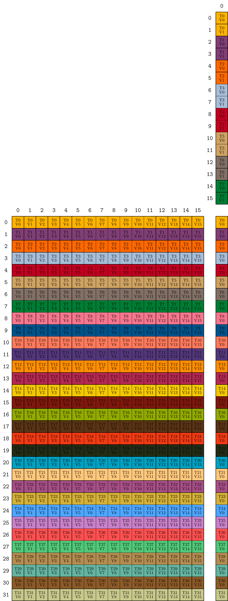
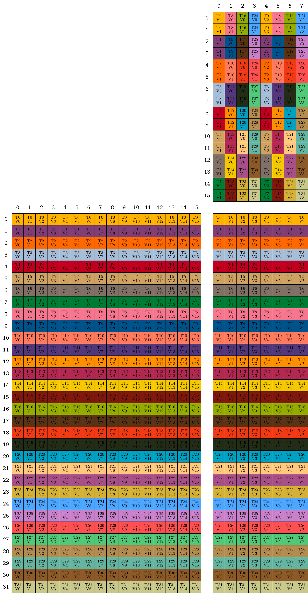

<!--
Copyright (c) 2026 Intel Corporation. All rights reserved.
SPDX-License-Identifier: BSD-3-Clause

Redistribution and use in source and binary forms, with or without
modification, are permitted provided that the following conditions are met:

1. Redistributions of source code must retain the above copyright notice, this
list of conditions and the following disclaimer.

2. Redistributions in binary form must reproduce the above copyright notice,
this list of conditions and the following disclaimer in the documentation
and/or other materials provided with the distribution.

3. Neither the name of the copyright holder nor the names of its
contributors may be used to endorse or promote products derived from
this software without specific prior written permission.

THIS SOFTWARE IS PROVIDED BY THE COPYRIGHT HOLDERS AND CONTRIBUTORS "AS IS"
AND ANY EXPRESS OR IMPLIED WARRANTIES, INCLUDING, BUT NOT LIMITED TO, THE
IMPLIED WARRANTIES OF MERCHANTABILITY AND FITNESS FOR A PARTICULAR PURPOSE ARE
DISCLAIMED. IN NO EVENT SHALL THE COPYRIGHT HOLDER OR CONTRIBUTORS BE LIABLE
FOR ANY DIRECT, INDIRECT, INCIDENTAL, SPECIAL, EXEMPLARY, OR CONSEQUENTIAL
DAMAGES (INCLUDING, BUT NOT LIMITED TO, PROCUREMENT OF SUBSTITUTE GOODS OR
SERVICES; LOSS OF USE, DATA, OR PROFITS; OR BUSINESS INTERRUPTION) HOWEVER
CAUSED AND ON ANY THEORY OF LIABILITY, WHETHER IN CONTRACT, STRICT LIABILITY,
OR TORT (INCLUDING NEGLIGENCE OR OTHERWISE) ARISING IN ANY WAY OUT OF THE USE
OF THIS SOFTWARE, EVEN IF ADVISED OF THE POSSIBILITY OF SUCH DAMAGE.
-->

# CuTe's Support for the XE4 TMM (Tensor Matrix Multiply) Instruction

This page is the **Intel XE4 analogue** of the general CuTe MMA atom
documentation found in [`0t_mma_atom.md`](0t_mma_atom.md).
That page introduces the Operation struct / `MMA_Traits` / `MMA_Atom` /
`TiledMMA` wrapping pattern using NVIDIA CUDA examples; this page applies
the exact same pattern to the synchronous, register-based **TMM** instruction
introduced on Intel XE4 GPUs.

The NVIDIA public reference for the general MMA atom pattern is also available
at https://docs.nvidia.com/cutlass/latest/media/docs/cpp/cute/0t_mma_atom.html.

---

## Introduction

**TMM (Tensor Matrix Multiply)** is a synchronous, register-based
Matrix-Multiply-Accumulate (MMA) instruction available on Intel XE4 GPUs.
A single TMM instruction computes:

```
D[M, N] = A[M, K] * B[K, N] + C[M, N]
```

where:

| Dimension | Value | Notes |
|-----------|-------|-------|
| `M` | **32** | Always 32; fixed by hardware |
| `K` | type-determined | Derived from the element types of A and B (see table below) |
| `N` | template parameter | Any value in `{1, 2, 3, 4, 8, 16, 32}` |

The **K dimension is determined by the element type** with the larger bit-width
among A and B (if equal, A is the determining type):

| Element type | K |
|---|---|
| `tfloat32_t` | 8 |
| `fp16`, `bfloat16` | 16 |
| `float_e5m2_t`, `float_e4m3_t`, `float_e2m1_t` | 32 |
| `int8_t`, `uint8_t` | 32 |

All 32 lanes in a **subgroup** cooperate on a single TMM call — the subgroup
is the cooperating execution unit on XE4, analogous to a CUDA warp on NVIDIA
hardware (though note that older Intel Xe generatrions sub-groups  16-wide or 32-wide; 
on XE4 the TMM instruction specifically requires a 32-lane subgroup).

CuTe wraps the TMM hardware instruction with the same four-layer pattern
described in [`0t_mma_atom.md`](0t_mma_atom.md):

1. **Operation struct** (`XE4_TMM`) — wraps the inline-assembly TMM call.
2. **`MMA_Traits`** specialization — declares logical shapes, types, and
   fragment layouts for the Operation.
3. **`MMA_Atom`** — the combination of Operation + Traits, usable as a
   first-class CuTe object.
4. **`TiledMMA`** — tiles the Atom across a workgroup tile, distributing work
   across multiple subgroups.

---

## Operation Struct: `XE4_TMM`

**Header:** `include/cute/arch/mma_xe4_tmm.hpp`

### Template Signature

```cpp
template <class d_type, class a_type, class b_type, class c_type,
          int N = 32, int kSubGroupSize = 32>
struct XE4_TMM;
```

Template parameters:

| Parameter | Description |
|-----------|-------------|
| `d_type` | Element type of the output matrix D |
| `a_type` | Element type of input matrix A |
| `b_type` | Element type of input matrix B |
| `c_type` | Element type of accumulator matrix C |
| `N` | Atom N dimension (columns of D, B); must be in `{1, 2, 3, 4, 8, 16, 32}` |
| `kSubGroupSize` | Threads per subgroup; must be 32 for TMM |

The struct exposes the following compile-time constants:

```cpp
static constexpr int M = 32;                            // hardware-fixed
static constexpr int K = tmm_k_for<a_type, b_type>::value;
static constexpr int N_val = N;                         // atom N
```

### Type Aliases

`XE4_TMM` exposes the same four public register-array type aliases as any
CuTe Operation struct:

```cpp
using DRegisters = sycl::vec<uint32_t, DSize>;
using ARegisters = sycl::vec<uint32_t, ASize>;
using BRegisters = sycl::vec<uint32_t, BSize>;
using CRegisters = sycl::vec<uint32_t, CSize>;
```

Each `*Size` constant is the number of 32-bit register units **per lane**
required to hold that matrix's portion:

```
ASize = ceil(K  * bits(a_type) / 32)       // one row of K elements
BSize = ceil(N * K * bits(b_type) / 1024)  // column-stripe across 32 lanes
CSize = ceil(N  * bits(c_type) / 32)       // one row of N elements
DSize = ceil(N  * bits(d_type) / 32)       // one row of N elements
```

For example, with `a_type = fp16` (16-bit), `b_type = fp16`, `N = 8`,
`K = 16` (since `fp16` → K=16):

```
ASize = ceil(16 * 16 / 32) = 8  uint32 registers per lane
BSize = ceil(8 * 16 * 16 / 1024) = 2  uint32 registers per lane
CSize = ceil(8 * 32 / 32) = 8  uint32 registers per lane (float accumulator)
```

### The `fma` Functions

The Operation struct provides two overloads of a static `fma` function.

**Four-operand form** — `D = A * B + C`:

```cpp
CUTE_HOST_DEVICE static void
fma(DRegisters& dst, ARegisters const& a, BRegisters const& b, CRegisters const& c);
```

**Three-operand form** — `D = A * B` (no accumulator):

```cpp
CUTE_HOST_DEVICE static void
fma(DRegisters& dst, ARegisters const& a, BRegisters const& b);
```

Both overloads emit the hardware TMM instruction using inline assembly on
device, and are no-ops on host (allowing programs to compile on CPU for
testing). The instruction string is assembled at compile time from the
PISA type-name helpers:

```cpp
"tmm.<d_type>_<a_type>_<b_type>_<c_type>.m32n<N>k<K>"
```

For example, `XE4_TMM<float, fp16, fp16, float, 8>` emits:

```
tmm.f32_f16_f16_f32.m32n8k16
```

---

## `MMA_Traits` Specialization

**Header:** `include/cute/atom/mma_traits_xe4_tmm.hpp`

The `MMA_Traits<XE4_TMM<...>>` specialization provides the meta-information
that CuTe's generic partitioning infrastructure needs to use the TMM
instruction with arbitrary tensors.

### Full Specialization

```cpp
template <class d_type, class a_type, class b_type, class c_type, int N>
struct MMA_Traits<XE4_TMM<d_type, a_type, b_type, c_type, N>>
{
  using MMA_Op = XE4_TMM<d_type, a_type, b_type, c_type, N>;

  using ValTypeD = d_type;
  using ValTypeA = a_type;
  using ValTypeB = b_type;
  using ValTypeC = c_type;

  using FrgTypeA = a_type;
  using FrgTypeB = b_type;
  using FrgTypeC = c_type;

  static constexpr int M_atom = MMA_Op::M;   // 32
  static constexpr int K_atom = MMA_Op::K;   // type-determined

  using Shape_MNK = Shape<Int<M_atom>, Int<N>, Int<K_atom>>;

  // 32 lanes cooperate on each TMM instruction
  using ThrID = Layout<_32>;

  // (tid, vid) -> (m, k)  — Matrix A fragment layout
  using ALayout = tmm::ALayout<a_type, M_atom, K_atom>;

  // (tid, vid) -> (k, n)  — Matrix B fragment layout
  using BLayout = tmm::BLayout<b_type, K_atom, N>;

  // (tid, vid) -> (m, n)  — Matrix C/D fragment layout
  using CLayout = tmm::CLayout<c_type, M_atom, N>;
};
```

### Type Aliases

| Alias | Meaning |
|-------|---------|
| `ValTypeD / A / B / C` | Logical element types of D, A, B, C |
| `FrgTypeA / B / C` | Fragment element types (same as `ValType*`; `mma_unpack` recasts to register types via `MMA_Op::*Registers`) |
| `Shape_MNK` | Logical shape of one atom: `(M=32, N, K)` |
| `ThrID` | `Layout<_32>` — all 32 lanes participate with stride 1 |
| `ALayout` | Maps `(tid, vid)` pairs to flat `(M, K)` coordinates for A |
| `BLayout` | Maps `(tid, vid)` pairs to flat `(K, N)` coordinates for B |
| `CLayout` | Maps `(tid, vid)` pairs to flat `(M, N)` coordinates for C/D |

### Visualizing the TV Layouts

Just as the NVIDIA documentation shows the per-thread data ownership for each
HMMA atom (e.g. `HMMA.8x8x4.NT`), the diagrams below show the
`(thread, value) -> (matrix coordinate)` mapping for two representative TMM
atoms. Each cell is labeled `T<tid>/V<vid>`, colored by `tid`, with the C
matrix on the upper right, A on the bottom left, and B on the upper center —
matching the layout produced by `cute::print_latex(MMA_Atom<...>)`.

#### `XE4_TMM<float, fp16, fp16, float, /*N=*/1>` (M=32, N=1, K=16)

This is the smallest TMM atom for `fp16` inputs. Lanes 0–7 each hold two
contiguous K-elements of B (because `packF<fp16> = 2`); lanes 8–31 do not
participate in B. A and C show lane `i` owning row `i`.



#### `XE4_TMM<float, fp16, fp16, float, /*N=*/8>` (M=32, N=8, K=16)

The larger N=8 atom uses all 32 lanes for B. Each lane holds 4 elements of B,
distributed as two 2-element packed-K units across two columns spaced 4 apart
(reflecting the nested `Shape<Shape<8,4>, Shape<2,2>>` of `tmm::BLayout`). A
and C remain "lane i owns row i".



> **Reproducing these images:** build the C++ generator and run it:
> ```
> source /opt/intel/oneapi/setvars.sh
> cmake -S media/docs/cpp/cute -B /tmp/xe4_tmm_doc -DCMAKE_CXX_COMPILER=icpx
> cmake --build /tmp/xe4_tmm_doc
> ```
> If `pdflatex` and `pdftoppm` (poppler-utils) are also installed, the build
> automatically compiles `.tex → .pdf → .png` and updates
> `media/images/cute/` in-source.  Without them, the `.tex` files land in
> `/tmp/xe4_tmm_doc/tex/` and can be converted manually with
> `pdflatex file.tex && pdftoppm -png -r 150 file.pdf file -singlefile`.

### Printing the Shape and Stride of TV Layouts

The three TV layouts of an `MMA_Atom` can be inspected at runtime with
`cute::print`. Pull them off the atom's `MMA_Traits` (or the corresponding
`AtomLayoutA/B/C` aliases on a `TiledMMA`):

```cpp
#include <cute/atom/mma_atom.hpp>
#include <cute/atom/mma_traits_xe4_tmm.hpp>

using namespace cute;
using TMM_Op = XE4_TMM<float, fp16, fp16, float, /*N=*/8>;   // M=32, K=16

// (1) Directly off the traits
using Traits = MMA_Traits<TMM_Op>;
print("ALayout: "); print(Traits::ALayout{}); print("\n");
print("BLayout: "); print(Traits::BLayout{}); print("\n");
print("CLayout: "); print(Traits::CLayout{}); print("\n");

// (2) Or off an MMA_Atom / TiledMMA
auto atom = MMA_Atom<TMM_Op>{};
print("Atom A: "); print(typename decltype(atom)::LayoutA_TV{}); print("\n");
print("Atom B: "); print(typename decltype(atom)::LayoutB_TV{}); print("\n");
print("Atom C: "); print(typename decltype(atom)::LayoutC_TV{}); print("\n");
```

`cute::print` formats a layout as `Shape:Stride`. Static (compile-time)
integers are rendered with a leading underscore (e.g. `_32`). Nested modes
appear as parenthesized tuples — exactly matching the `Layout<Shape<...>,
Stride<...>>` declarations in `mma_traits_xe4_tmm.hpp`.

Sample output for the snippet above (`fp16, N=8`):

```text
ALayout: (_32,_16):(_1,_32)
BLayout: ((_8,_4),(_2,_2)):((_16,_1),(_8,_4))
CLayout: (_32,_8):(_1,_32)
```

#### Layouts for Common TMM Atom Configurations

The table below gives the printed `Shape:Stride` produced by `cute::print` for
each fragment of several representative atoms (all use `M=32`; `K` is fixed by
the major input type — see `tmm_k_for` in `mma_xe4_tmm.hpp`):

| Atom | `ALayout` | `BLayout` | `CLayout` |
|------|-----------|-----------|-----------|
| `XE4_TMM<float, fp16, fp16, float, 1>`  | `(_32,_16):(_1,_32)` | `((_8,_1),(_2,_1)):((_2,_1),(_1,_1))`   | `(_32,_1):(_1,_32)`  |
| `XE4_TMM<float, fp16, fp16, float, 8>`  | `(_32,_16):(_1,_32)` | `((_8,_4),(_2,_2)):((_16,_1),(_8,_4))`  | `(_32,_8):(_1,_32)`  |
| `XE4_TMM<float, fp16, fp16, float, 16>` | `(_32,_16):(_1,_32)` | `((_8,_4),(_2,_4)):((_32,_1),(_16,_4))` | `(_32,_16):(_1,_32)` |
| `XE4_TMM<float, fp16, fp16, float, 32>` | `(_32,_16):(_1,_32)` | `((_8,_4),(_2,_8)):((_64,_1),(_32,_4))` | `(_32,_32):(_1,_32)` |
| `XE4_TMM<float, bf16, bf16, float, 8>`  | `(_32,_16):(_1,_32)` | `((_8,_4),(_2,_2)):((_16,_1),(_8,_4))`  | `(_32,_8):(_1,_32)`  |
| `XE4_TMM<float, e4m3, e4m3, float, 8>`  | `(_32,_32):(_1,_32)` | `((_8,_4),(_4,_2)):((_32,_1),(_8,_4))`  | `(_32,_8):(_1,_32)`  |
| `XE4_TMM<float, e4m3, e4m3, float, 16>` | `(_32,_32):(_1,_32)` | `((_8,_4),(_4,_4)):((_64,_1),(_16,_4))` | `(_32,_16):(_1,_32)` |
| `XE4_TMM<float, e2m1, e2m1, float, 8>`  | `(_32,_32):(_1,_32)` | `((_4,_8),(_8,_1)):((_64,_1),(_8,_8))`  | `(_32,_8):(_1,_32)`  |

Reading the table:
- `ALayout` and `CLayout` always factor as `(M, K_or_N) : (_1, M)` —
  lane `i` owns row `i` and consecutive K/N elements of that row are stored
  contiguously across that lane's registers.
- `BLayout`'s outer mode `((K/F, maxLanes·F/K), …)` partitions the 32 lanes
  along the packed-K direction (`K/F` lanes per packed column) and stripes
  multiple columns into one packed group when `K/F < 32`.
- `BLayout`'s inner mode `(F, nRegsB)` walks each lane's `nRegsB` registers,
  with `F = packF<T> = 32/bits(T)` packed elements per register.

### Fragment Layout Builders (`namespace tmm`)

The three layout aliases above are constructed from reusable helpers in the
`tmm` namespace defined in `mma_traits_xe4_tmm.hpp`.

#### Helper constants

```cpp
// packingFactor: elements that fit in one 32-bit register
template <class T>
inline constexpr int packF = 32 / cute::sizeof_bits_v<T>;
// e.g. float->1, fp16->2, bf16->2, e5m2->4, e4m3->4, e2m1->8

// Fragment register counts (uint32 units per lane)
template <class T, int K>           inline constexpr int nRegsA = (K + packF<T> - 1) / packF<T>;
template <class T, int K, int N>    inline constexpr int nRegsB = (N*K*sizeof_bits_v<T> + 1023) / 1024;
template <class T, int N>           inline constexpr int nRegsC = (N + packF<T> - 1) / packF<T>;
```

#### `tmm::ALayout` — Matrix A fragment

A[32, K]: lane `i` (thread ID = `i`) owns **row i** of A.
Each lane holds `nRegsA` registers, each packing `packF` consecutive
K-elements.

```cpp
template <class T, int M, int K>
using ALayout = Layout<
    Shape <Int<M>, Int<K>>,
    Stride<_1,     Int<M>>
>;
```

This encodes the mapping `(tid=i, vid=j)` → flat index `i + j*M` (column-major
over the M×K element space, i.e. M-major / column-major A).

#### `tmm::BLayout` — Matrix B fragment

B[K, N]: elements are packed along K into 32-bit units, then distributed
across 32 lanes **column by column** (N direction).

Let `F = packF<T>` (elements per uint32) and `P = K/F` (packed-K units
per column).

For the common case where `N*P ≥ 32` and `N*P % 32 == 0`, each lane holds
`nRegsB` registers, and the layout factors into a nested form that accounts
for the column-stripe distribution:

```cpp
template <class T, int K, int N>
using BLayout = Layout<
    Shape < Shape< Int<K/packF<T>>,
                   Int<(tmmLayoutBMaxLanes<T,K,N>::value * packF<T>)/K> >,
            Shape <Int<packF<T>>,  Int<nRegsB<T,K,N>>>>,
    Stride< Stride<Int<N*packF<T>>, _1>,
            Stride<Int<N>, Int<(tmmLayoutBMaxLanes<T,K,N>::value * packF<T>)/K>>>
>;
```

The outer `Shape` mode splits the 32 lanes into `(K/F, 32*F/K)` to avoid
out-of-bounds when `K/F < 32`; the inner `Shape` mode iterates over
packed registers and elements within them.

The `tmmLayoutBMaxLanes` helper computes how many of the 32 lanes are
actually used for a single column of B:

```cpp
template <typename T, int K, int N>
struct tmmLayoutBMaxLanes {
  static constexpr int elem_bits  = cute::sizeof_bits_v<T>;
  static constexpr int total_bits = K * N * elem_bits;
  static constexpr int value      = cute::min(Int<total_bits / 32>{}, Int<32>{});
};
```

#### `tmm::CLayout` — Matrix C/D fragment

C[32, N] and D[32, N] have exactly the same per-lane ownership pattern as A:
lane `i` owns row `i`, with `N` elements packed into `nRegsC` registers.

```cpp
template <class T, int M, int N>
using CLayout = ALayout<T, M, N>;
```

---

## `MMA_Atom` and `TiledMMA`

### Building the Atom

An `MMA_Atom` bundles the Operation struct with its Traits:

```cpp
using TMM_Op  = XE4_TMM<float, fp16, fp16, float, /*N=*/8>;
auto  mma_atom = MMA_Atom<TMM_Op>{};
```

This atom covers one hardware instruction: a 32×8×16 tile (M=32, N=8, K=16),
executed cooperatively by 32 lanes.

### Building a `TiledMMA`

To cover a larger workgroup tile (e.g. 64×64×16), you tile the atom across
multiple subgroups using `make_tiled_mma`:

```cpp
// AtomLayoutMNK: how consumer subgroups are arranged over the workgroup tile
// Here: 2 SGs along M, 4 SGs along N, 1 SG along K → 8 consumer SGs total
auto sg_layout = make_layout(make_shape(_2{}, _4{}, _1{}),
                             make_stride(_1{}, _2{}, _0{}));
using SgLayout = decltype(sg_layout);

auto tiled_mma = make_tiled_mma(
    MMA_Atom<TMM_Op>{},                      // the hardware instruction
    SgLayout{},                              // subgroup arrangement
    Tile<Int<64>, Int<64>, Int<16>>{});      // workgroup tile dimensions
```

With this `TiledMMA`, a 64×64×16 tile is covered by 2×4 = 8 consumer
subgroups, each executing 2×8 = 16 TMM calls (1 call per M-atom × N-tile
iteration, repeated over the K dimension).

### Auto-computed Subgroup Layout

The utility `default_warp_layout_for_tiled_mma` (in
`test/unit/cute/xe4/tiled_mma_utils.hpp`) computes the optimal subgroup layout
automatically using a greedy largest-dimension-first algorithm:

```cpp
using SgLayout = typename cute::default_warp_layout_for_tiled_mma<
    TMM_Op,
    /*bM=*/64, /*bN=*/64, /*bK=*/16,
    /*WorkgroupSize=*/320, /*SubgroupSize=*/32,
    /*NumProducerSGs=*/2>::type;
```

The algorithm:

1. Compute `num_consumer_sgs = WorkgroupSize / SubgroupSize - NumProducerSGs`.
2. Sort `(bM, bN, bK)` by tile size descending.
3. For the largest dimension, assign `sg_dim = min(tile/atom, remaining_budget)`.
4. Repeat for the remaining two dimensions.
5. Static-assert if the budget is not evenly consumed.

For the 64×64×16 tile with `kWorkGroupSize=320`, `kSubGroupSize=32`,
`kNumProducerSGs=2`:

- `num_consumer_sgs = 320/32 - 2 = 8`
- Sort tile dims descending: `bM = 64` (largest, p0=M), `bN = 64` (next, p1=N), `bK = 16` (smallest, p2=K)
- Atom counts per dim: `t_M = 64/32 = 2`, `t_N = 64/8 = 8`, `t_K = 16/16 = 1`
- Greedy assignment:
  - `sg_M = min(num_consumer_sgs, t_M) = min(8, 2) = 2`; remaining = `8 / 2 = 4`
  - `sg_N = min(remaining, t_N)    = min(4, 8) = 4`; remaining = `4 / 4 = 1`
  - `sg_K = remaining = 1`
- Result: `Layout<Shape<_2, _4, _1>>`

---

## Worked Example: TMM GEMM with TiledMMA

The following is the canonical usage pattern from PR #422:

```cpp
// 1. Define the atom — only instruction-level dimensions, no tile sizes
using TMM_Op = XE4_TMM<float, fp16, fp16, float, 8>;  // M=32 (fixed), K=16 (from types), N=8

// 2. Warp layout at CTA — choose ONE of the following:

// Option A: Auto-computed default (greedy largest-dimension-first)
// in test/unit/cute/xe4/tiled_mma_utils.hpp
using SgLayout = typename cute::default_warp_layout_for_tiled_mma<
    TMM_Op, bM, bN, bK,
    kWorkGroupSize, kSubGroupSize, kNumProducerSGs>::type;

// Option B: User-specified — full control over subgroup tiling
//   Must satisfy: AtomM*SgM divides bM, AtomN*SgN divides bN, AtomK*SgK divides bK
//   and SgM*SgN*SgK == num_consumer_subgroups
using SgLayout = Layout<Shape<_2, _4, _1>>;  // example: 8 consumer SGs over a 64x64x16 tile

// 3. Build TiledMMA — atom × sg_layout × tile
auto tiled_mma = make_tiled_mma(
    MMA_Atom<TMM_Op>{},                   // the hardware instruction
    SgLayout{},                           // how consumer SGs tile the workgroup tile
    Tile<Int<bM>, Int<bN>, Int<bK>>{});   // workgroup tile to cover

// 4. Partition & compute — standard CuTe pattern
auto thr_mma = tiled_mma.get_slice((int)my_lane_id);
Tensor tCsA  = thr_mma.partition_A(sA);
Tensor tCsB  = thr_mma.partition_B(sB);
Tensor accum = thr_mma.make_fragment_C(thr_mma.partition_C(gC));
clear(accum);

gemm(tiled_mma, tCsA, tCsB, accum);  // all TMM calls generated automatically
```

### End-to-End GEMM Kernel Structure

The full example in `examples/cute/tutorial/xe4/gemm_tiled_tmma.cpp` uses a
**producer–consumer split** within the workgroup:

- **Producer subgroups** (e.g., 2 out of 10 total) load A and B tiles from
  global memory into shared local memory (SLM) using plain `copy()`.
- **Consumer subgroups** (the remaining 8) run TMM via `tmma_gemm` (in
  `examples/cute/tutorial/xe4/gemm_tiled_tmma.hpp`), which partitions the
  SLM tensors with `TiledMMA` and calls `cute::gemm(tiled_mma, ...)`.

The kernel skeleton (from `gemm_device` in `gemm_tiled_tmma.cpp`):

```cpp
// Tile global tensors to this workgroup
auto wg_coord = make_coord(BlockIdxX(), BlockIdxY(), _);
Tensor gA = local_tile(mA, wg_tiler, wg_coord, Step<_1, X, _1>{});
Tensor gB = local_tile(mB, wg_tiler, wg_coord, Step< X,_1, _1>{});
Tensor gD = local_tile(mD, wg_tiler, wg_coord, Step<_1,_1,  X>{});

if (my_sg_id < kNumProducerSubGroups) {
  // Producers: copy tiles from global to SLM
  while (ktile_idx < ktile_count) {
    sycl::group_barrier(it.get_group());
    if (my_sg_id == 0) copy(gA(_, _, ktile_idx), sA);
    else               copy(gB(_, _, ktile_idx), sB);
    sycl::group_barrier(it.get_group());
    ++ktile_idx;
  }
} else {
  // Consumers: run TMM on SLM tiles
  while (ktile_idx < ktile_count) {
    sycl::group_barrier(it.get_group());
    tmma_gemm<bM, bN, bK,
              xe4_tmma_op_t, cta_warp_layout_t, copy_op_t,
              kNumProducerSubGroups>(sA, sB, sD, it);
    sycl::group_barrier(it.get_group());
    ++ktile_idx;
  }
  copy(sD, gD);  // write back to global memory
}
```

The `tmma_gemm` function (in `gemm_tiled_tmma.hpp`) applies the standard
CuTe partition-and-compute idiom:

```cpp
auto tiled_mma = make_tiled_mma(MMA_Atom<MMA_Op>{}, CTA_Warp_Layout{});
auto thr_mma   = tiled_mma.get_slice((int)my_wg_level_lane_id);

auto tAgA = thr_mma.partition_A(gA);   // (Vals, REST_M, REST_K)
auto tBgB = thr_mma.partition_B(gB);   // (Vals, REST_N, REST_K)
auto tDgD = thr_mma.partition_C(gD);   // (Vals, REST_M, REST_N)

auto tArA = thr_mma.make_fragment_A(tAgA);
auto tBrB = thr_mma.make_fragment_B(tBgB);
auto tDrD = thr_mma.make_fragment_C(tDgD);

// Manual copy to registers (simple element-wise for this example)
for (int i = 0; i < size(tAgA); ++i) tArA(i) = tAgA(i);
for (int i = 0; i < size(tBgB); ++i) tBrB(i) = tBgB(i);
for (int i = 0; i < size(tDgD); ++i) tDrD(i) = tDgD(i);

// Compute with TMM through CuTe's tiled MMA path
cute::gemm(tiled_mma, tArA, tBrB, tDrD);

copy(tDrD, tDgD);  // write register fragments back to SLM output tile
```

### Launch Configuration

For a 256×256×256 GEMM problem with workgroup tile 64×64×64 and
`TMM_ATOM_N = 8`, `fp16` inputs and `float` accumulation:

```cpp
constexpr int kWorkGroupSize      = 320;  // 10 subgroups × 32 lanes
constexpr int kSubGroupSize       = 32;
constexpr int kNumProducerSubGroups = 2;
constexpr int TMM_ATOM_N            = 8;

using xe4_tmma_op_t   = XE4_TMM<float, fp16, fp16, float, TMM_ATOM_N>;
using cta_warp_layout_t = Layout<Shape<_2, _4, _1>, Stride<_1, _2, _0>>;
// 2 SGs along M, 4 SGs along N → 8 consumer SGs covering the 64×64 C-tile

sycl::range<3> local_range(1, 1, kWorkGroupSize);
sycl::range<3> group_range(1, N_tiles, M_tiles);
sycl::nd_range<3> global_range(group_range * local_range, local_range);

q.submit([&](sycl::handler& h) {
  h.parallel_for(global_range,
    [=](sycl::nd_item<3> it)
    [[sycl::reqd_work_group_size(1, 1, kWorkGroupSize)]]
    [[sycl::reqd_sub_group_size(kSubGroupSize)]]
    {
      gemm_tmm::gemm_device<
          ProblemShape, WGTileShape, cta_warp_layout_t,
          xe4_tmma_op_t, UniversalCopy<uint32_t>,
          fp16, fp16, float, float,
          float, float, float,
          kSubGroupSize, kNumProducerSubGroups, kWorkGroupSize>(
            A_ptr, B_ptr, C_ptr, D_ptr, Bias_ptr, alpha, beta, it);
    });
});
```

---

## Key Differences from NVIDIA MMA Atoms

| Aspect | NVIDIA (CUTLASS/CuTe) | Intel XE4 TMM |
|--------|-----------------------|---------------|
| Cooperating unit | warp (32 threads) or warpgroup (128 threads) | subgroup (32 lanes, `kSubGroupSize=32`) |
| Fixed M dimension | varies by instruction (e.g. 8, 16, 64) | always **32** |
| Register arrays | `using DRegisters = float[8]` (plain C arrays) | `using DRegisters = sycl::vec<uint32_t, DSize>` |
| Instruction emission | PTX `mma.sync.*` | PISA `tmm.*` via SYCL inline asm |
| Host guard | `#if defined(__CUDA_ARCH__)` | `#if defined(__SYCL_DEVICE_ONLY__)` |
| Fragment layout (B) | depends on transpose mode (NT/TN/NN/TT) | K-major, column-stripe distribution encoded as nested CuTe layout |
| Subgroup layout utility | N/A (warp layout is implicit) | `default_warp_layout_for_tiled_mma<>` in `test/unit/cute/xe4/tiled_mma_utils.hpp` |

---

## Related Files

> **Note:** The source files listed below (`mma_xe4_tmm.hpp`, `mma_traits_xe4_tmm.hpp`,
> `tiled_mma_utils.hpp`, and the `gemm_tiled_tmma.*` examples) are introduced in
> PR #422 (`vamsikku_tmma_atoms`). This documentation page is intended to accompany
> that PR; all file references assume it has been merged.

| File | Purpose |
|------|---------|
| `include/cute/arch/mma_xe4_tmm.hpp` | `XE4_TMM` Operation struct and PISA type helpers |
| `include/cute/atom/mma_traits_xe4_tmm.hpp` | `MMA_Traits` specialization and `tmm::ALayout/BLayout/CLayout` builders |
| `test/unit/cute/xe4/tiled_mma_utils.hpp` | `default_warp_layout_for_tiled_mma` compile-time utility |
| `examples/cute/tutorial/xe4/gemm_tiled_tmma.hpp` | `tmma_gemm` device function template |
| `examples/cute/tutorial/xe4/gemm_tiled_tmma.cpp` | End-to-end GEMM driver using TMM with producer–consumer pattern |
| [`0t_mma_atom.md`](0t_mma_atom.md) | General CuTe MMA atom documentation (NVIDIA examples) |
| [`0x_gemm_tutorial.md`](0x_gemm_tutorial.md) | How `TiledMMA` is used to partition tensors in a GEMM |
